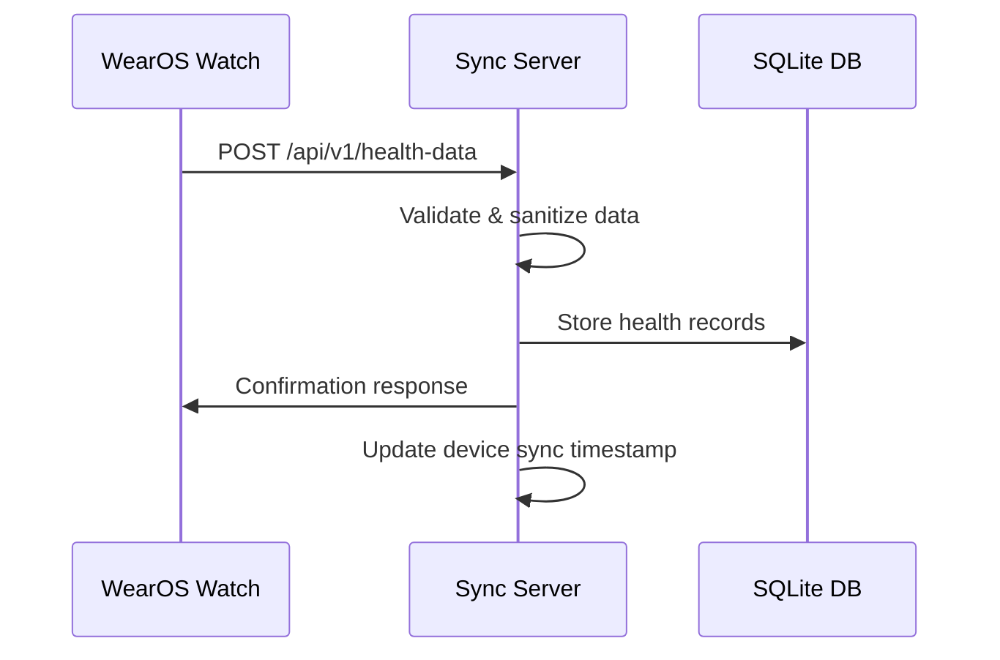
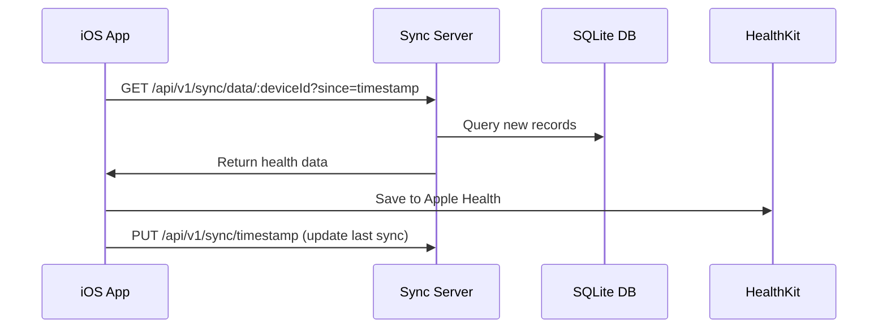

# Galaxy Watch Local Data Sync Server

[](https://nodejs.org/)
[](#installation)
[](LICENSE)

A privacy-focused, local data synchronization server that enables health data sharing between Samsung Galaxy Watch (WearOS) and iPhone (iOS/Apple Health) without relying on cloud services like Firebase.

## 🌟 Features

### Two-Tiered Hybrid Architecture

- **Primary Transport**: Local Wi-Fi Server (REST API)
- **Fallback Transport**: Bluetooth Low Energy (BLE)
- **Stateful Syncing**: Timestamp-based synchronization prevents data duplication

### Privacy-First Design

- ✅ **No cloud dependencies** - All data stays on your local network
- ✅ **Cross-platform server** - Runs on Windows, macOS, and Linux
- ✅ **Automatic transport switching** - Seamlessly falls back to Bluetooth when Wi-Fi is unavailable
- ✅ **Data validation** - Comprehensive health data validation and sanitization
- ✅ **Comprehensive logging** - Detailed operation logs for debugging and monitoring

### Supported Health Data Types

- Heart Rate
- Steps
- Sleep Data
- Activity/Workout Sessions
- Blood Pressure
- Blood Oxygen (SpO2)
- Body Temperature
- GPS Routes
- Calories Burned
- Distance
- Floors Climbed

## 🏗️ Architecture Overview

```
┌─────────────────┐    WiFi/HTTP     ┌─────────────────┐    HealthKit    ┌─────────────────┐
│ Samsung Galaxy  │ ◄──────────────► │ Local Sync      │ ◄─────────────► │ iPhone (iOS)    │
│ Watch (WearOS)  │                  │ Server          │                 │ Apple Health    │
└─────────────────┘                  └─────────────────┘                 └─────────────────┘
         │                                    │                                   │
         │           Bluetooth LE             │                                   │
         └────────────────────────────────────┼───────────────────────────────────┘
                     (Fallback)               │
                                              │
                                     ┌─────────────────┐
                                     │ SQLite Database │
                                     │ (Local Storage) │
                                     └─────────────────┘
```

## 🚀 Quick Start

### Prerequisites

- Node.js 16.0.0 or higher
- npm 8.0.0 or higher
- Windows 10/11, macOS 10.15+, or Linux

### Installation

1. **Clone or download the project**:

   ```bash
   git clone https://github.com/your-org/galaxy_watch_local_data_sync_server.git
   cd galaxy_watch_local_data_sync_server
   ```

2. **Install dependencies**:

   ```bash
   npm install
   ```

3. **Start the server**:

   ```bash
   npm start
   ```

4. **For development with auto-restart**:
   ```bash
   npm run dev
   ```

The server will start on `http://localhost:3000` by default and will display your local IP address for device connections.

### Quick Test

Open your browser and navigate to:

- Health check: `http://localhost:3000/health`
- API documentation: `http://localhost:3000/`

## 📱 Device Integration

### WearOS (Samsung Galaxy Watch)

#### HTTP Sync Implementation

```kotlin
// Example Kotlin code for WearOS app
class HealthDataSyncManager {
    private val serverUrl = "http://192.168.1.100:3000" // Your server IP

    suspend fun syncHealthData(deviceId: String, healthRecords: List<HealthRecord>) {
        val client = OkHttpClient()
        val json = Json.encodeToString(SyncRequest(
            deviceId = deviceId,
            dataType = "heart_rate",
            records = healthRecords
        ))

        val request = Request.Builder()
            .url("$serverUrl/api/v1/health-data")
            .post(json.toRequestBody("application/json".toMediaType()))
            .build()

        client.newCall(request).execute().use { response ->
            if (response.isSuccessful) {
                // Update last sync timestamp
                updateLastSyncTimestamp(response.body?.string())
            }
        }
    }
}
```

### iOS (iPhone)

#### HTTP Sync Implementation

```swift
// Example Swift code for iOS app
import HealthKit

class HealthDataSyncManager {
    private let serverURL = "http://192.168.1.100:3000" // Your server IP
    private let healthStore = HKHealthStore()

    func syncFromServer(deviceId: String, completion: @escaping (Result<Int, Error>) -> Void) {
        guard let url = URL(string: "\(serverURL)/api/v1/sync/data/\(deviceId)") else { return }

        var request = URLRequest(url: url)
        request.setValue("application/json", forHTTPHeaderField: "Content-Type")

        URLSession.shared.dataTask(with: request) { data, response, error in
            // Process received health data and save to HealthKit
            // Update local sync timestamp
        }.resume()
    }
}
```

## 🔌 API Reference

### Health Data Endpoints

#### POST `/api/v1/health-data`

Submit health data from devices.

**Request Body:**

```json
{
  "deviceId": "galaxy-watch-001",
  "deviceName": "Samsung Galaxy Watch",
  "deviceType": "wearos",
  "dataType": "heart_rate",
  "records": [
    {
      "timestamp": 1703936400000,
      "value": 72,
      "unit": "bpm",
      "metadata": {
        "accuracy": "high",
        "source": "sensor"
      }
    }
  ]
}
```

#### GET `/api/v1/health-data`

Retrieve health data with filtering options.

**Query Parameters:**

- `deviceId`: Filter by device ID
- `dataType`: Filter by data type
- `since`: Timestamp to get data after
- `until`: Timestamp to get data before
- `limit`: Maximum records to return (default: 1000)
- `offset`: Pagination offset

### Sync Management

#### POST `/api/v1/sync/register`

Register a device for synchronization.

#### GET `/api/v1/sync/status/:deviceId`

Get sync status and statistics for a device.

#### GET `/api/v1/sync/data/:deviceId`

Retrieve new health data for a device (used by iOS app).

### Bluetooth Management

#### GET `/api/v1/bluetooth/status`

Get Bluetooth service status.

#### POST `/api/v1/bluetooth/start`

Start Bluetooth advertising for fallback sync.

#### POST `/api/v1/bluetooth/stop`

Stop Bluetooth advertising.

## ⚙️ Configuration

The server can be configured via environment variables or by modifying `server/config/config.js`:

### Environment Variables

```bash
# Server Configuration
PORT=3000
HOST=0.0.0.0
NODE_ENV=development

# Database
DB_PATH=./data/health_sync.db

# Logging
LOG_LEVEL=info
```

### Config File Options

```javascript
// server/config/config.js
const config = {
    server: {
        port: 3000,
        host: '0.0.0.0'
    },
    healthData: {
        supportedTypes: ['heart_rate', 'steps', 'sleep', ...],
        maxRecordAge: 90 * 24 * 60 * 60 * 1000 // 90 days
    },
    bluetooth: {
        enabled: true,
        deviceName: 'GalaxyWatchSync',
        serviceUUID: '12345678-1234-1234-1234-123456789abc'
    }
};
```

## 📊 Data Flow

### 1. WearOS → Server (Data Upload)



### 2. Server → iOS (Data Download)



## 🔧 Development

### Project Structure

```
galaxy_watch_local_data_sync_server/
├── index.js                 # Main entry point
├── package.json             # Project configuration
├── .github/
│   └── copilot-instructions.md
├── server/
│   ├── app.js              # Express application
│   ├── config/
│   │   └── config.js       # Configuration settings
│   ├── database/
│   │   └── init.js         # Database initialization
│   ├── routes/
│   │   ├── healthData.js   # Health data API endpoints
│   │   ├── sync.js         # Sync management endpoints
│   │   └── bluetooth.js    # Bluetooth endpoints
│   └── utils/
│       ├── logger.js       # Logging utilities
│       └── validation.js   # Data validation
├── data/                   # SQLite database storage
├── logs/                   # Application logs
├── docs/                   # API documentation
└── examples/               # Client integration examples
    ├── wearos/            # Android/Kotlin examples
    └── ios/               # Swift/iOS examples
```

### Available Scripts

- `npm start` - Start the production server
- `npm run dev` - Start development server with auto-restart
- `npm run debug` - Start with debugging enabled
- `npm test` - Run tests (to be implemented)

### Logging

The server provides comprehensive logging:

- **app.log** - General application logs
- **error.log** - Error-specific logs
- **health-data.log** - Health data operations
- **sync.log** - Sync operations
- **bluetooth.log** - Bluetooth operations

## 🛡️ Security Considerations

### Local Network Security

- Server binds to all interfaces (0.0.0.0) for local network access
- CORS configured for local network IP ranges
- No external internet access required

### Data Privacy

- All health data stored locally in SQLite database
- No cloud storage or external API calls
- Data validation and sanitization for all inputs
- Automatic cleanup of old records (configurable)

### Bluetooth Security

- Uses standard BLE security protocols
- Custom UUIDs to prevent interference
- Connection timeouts and validation

## 🚨 Troubleshooting

### Common Issues

1. **Cannot connect from devices**:

   - Ensure all devices are on the same Wi-Fi network
   - Check firewall settings on the server machine
   - Verify the server IP address is correct

2. **Database errors**:

   - Ensure write permissions in the data directory
   - Check available disk space

3. **Bluetooth not working**:
   - Verify Bluetooth is enabled on the server machine
   - Check platform-specific Bluetooth requirements
   - Run `GET /api/v1/bluetooth/test` to diagnose issues

### Debug Mode

Start the server in debug mode to see detailed logs:

```bash
npm run debug
```

### Health Check

Monitor server health:

```bash
curl http://localhost:3000/health
```

## 🤝 Contributing

1. Fork the repository
2. Create a feature branch (`git checkout -b feature/amazing-feature`)
3. Commit your changes (`git commit -m 'Add amazing feature'`)
4. Push to the branch (`git push origin feature/amazing-feature`)
5. Open a Pull Request

## 📄 License

This project is licensed under the MIT License - see the [LICENSE](LICENSE) file for details.

## 🙏 Acknowledgments

- Samsung Health SDK for WearOS integration
- Apple HealthKit for iOS integration
- Node.js community for excellent libraries
- Contributors to open-source health data standards

## 📞 Support

For support and questions:

- Create an issue on GitHub
- Check the troubleshooting section above
- Review the API documentation at `http://localhost:3000/`

---

**Note**: This server is designed for personal use on local networks. For production deployments, additional security measures should be implemented.
